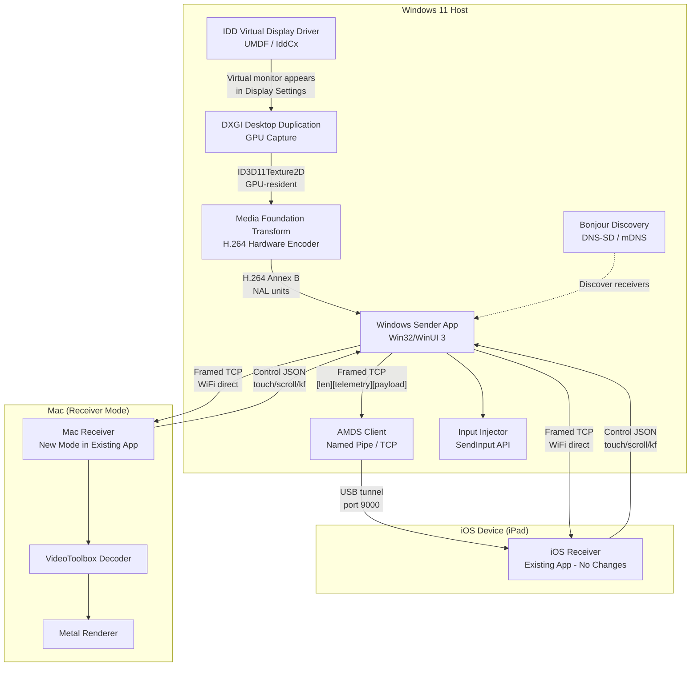
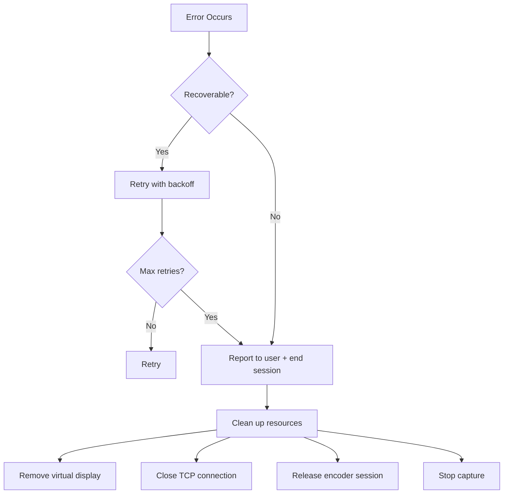

# Design Document: Windows Second Display

## Overview

This design extends OpenDisplay to support Windows 11 as a sender platform. The existing architecture follows a pipeline: virtual display creation → screen capture → H.264 encoding → framed TCP streaming to an iOS receiver. The Windows sender replicates this pipeline using Windows-native equivalents while maintaining full wire-protocol compatibility with the existing iOS receiver app.

Additionally, a new Mac receiver mode reverses the existing Mac-as-sender role, allowing a Mac to accept incoming connections from the Windows sender and display the stream on its screen.

### Key Design Decisions

1. **Separate driver and app projects** — The IDD virtual display driver is a kernel-mode/UMDF component that must be independently signed and installed. The sender app communicates with it via a user-mode interface (SwapChainProcessor + IddCx callbacks).
2. **Zero-copy capture path** — DXGI Desktop Duplication provides GPU-resident ID3D11Texture2D surfaces that can be passed directly to Media Foundation's hardware encoder without CPU readback.
3. **AMDS compatibility** — Windows uses the same usbmuxd plist protocol as macOS but over a named pipe (`\\.\pipe\usbmux`) or TCP (localhost:27015) instead of a Unix socket.
4. **Shared wire protocol** — The Windows sender speaks the identical framed TCP protocol (version 2) as the Mac sender, so the iOS receiver requires zero changes.
5. **CMake + WDK build** — The app and driver build from a single CMake super-project, with the driver as a separate UMDF target requiring Windows Driver Kit.

## Architecture

### High-Level System Diagram



### Windows Sender Pipeline (Data Flow)

```mermaid
sequenceDiagram
    participant DD as DXGI Desktop Duplication
    participant ENC as MFT H.264 Encoder
    participant FRAME as Frame Builder
    participant TCP as TCP Transport
    participant RX as Receiver (iOS/Mac)

    loop Every frame (60 fps when content changes)
        DD->>DD: AcquireNextFrame()
        DD->>ENC: ID3D11Texture2D (zero-copy)
        Note over DD,ENC: Drop frame if encoder busy<br/>(pendingEncodes >= 1)
        ENC->>FRAME: H.264 Annex B NALUs
        FRAME->>FRAME: Prepend telemetry JSON prefix
        FRAME->>TCP: [4B len][telemetry][payload]
        Note over FRAME,TCP: Drop frame if send queue full<br/>(pendingSends >= 3)
        TCP->>RX: Framed TCP delivery
    end

### Session Lifecycle

```mermaid
sequenceDiagram
    participant WIN as Windows Sender
    participant RX as Receiver (iOS/Mac)

    WIN->>RX: TCP Connect (via USB tunnel or WiFi)
    RX->>WIN: hello {pixelsWide, pixelsHigh, scale, device, id, pv}
    WIN->>WIN: Create/resize virtual display
    WIN->>RX: welcome {type, pv, min}
    alt Receiver pv < sender minPeer
        WIN->>RX: updateRequired {target, store, message}
    end
    WIN->>RX: First frame (IDR + SPS/PPS)
    loop Streaming
        WIN->>RX: Video frames [len][telemetry][H.264]
        RX->>WIN: touch/scroll/kf control messages
        WIN->>RX: ping {type, t}
        RX->>WIN: pong {type, t, mt}
    end
    alt Receiver sleeps
        RX->>WIN: sleeping
        WIN->>WIN: Tear down virtual display, await wake
    else Receiver closes
        RX->>WIN: closing
        WIN->>WIN: End session
    end
```

## Components and Interfaces

### Component 1: IDD Virtual Display Driver (`OpenDisplayIdd`)

**Purpose:** Creates a virtual monitor visible to Windows Display Settings using the IddCx (Indirect Display Driver) UMDF framework.

**Technology:** C++ UMDF driver, IddCx 1.4+, WDK 10.0.22621.0

**Key Interfaces:**

```cpp
// Driver entry and IddCx adapter callbacks
class OpenDisplayDriver {
public:
    // IddCx lifecycle
    static NTSTATUS AdapterInitFinished(IDDCX_ADAPTER adapter);
    static NTSTATUS MonitorCreate(IDDCX_MONITOR* monitor,
                                  uint32_t widthPx, uint32_t heightPx,
                                  uint32_t refreshHz);
    static NTSTATUS MonitorDestroy(IDDCX_MONITOR monitor);
    static NTSTATUS MonitorAssignSwapChain(IDDCX_MONITOR monitor,
                                           IDDCX_SWAPCHAIN swapChain);
    static NTSTATUS MonitorUnassignSwapChain(IDDCX_MONITOR monitor);
};

// Communication channel from user-mode app to driver
// Uses DeviceIoControl on a device interface exposed by the driver
enum DriverIoctl : ULONG {
    IOCTL_CREATE_MONITOR   = CTL_CODE(...),  // {width, height, refreshHz}
    IOCTL_DESTROY_MONITOR  = CTL_CODE(...),  // {monitorId}
    IOCTL_RESIZE_MONITOR   = CTL_CODE(...),  // {monitorId, newWidth, newHeight}
};
```

**Design Rationale:**
- IddCx is the only supported Windows mechanism for creating virtual displays visible to the desktop compositor (DWM). Unlike `ChangeDisplaySettingsEx`, it creates a real display adapter that applications and the taskbar recognize.
- The driver exposes a device interface that the user-mode app opens via `CreateFile` + `DeviceIoControl`, keeping the driver minimal (no networking, no encoding logic).
- On unexpected process termination, the driver's `EvtDeviceD0Exit` or handle-close callback removes all monitors, preventing orphaned displays.

### Component 2: Screen Capture (`DesktopDuplicationCapture`)

**Purpose:** Captures the virtual display's framebuffer using the DXGI Desktop Duplication API, providing GPU-resident textures to the encoder.

**Technology:** DXGI 1.2+, Direct3D 11, ID3D11Device/ID3D11DeviceContext

**Key Interfaces:**

```cpp
class DesktopDuplicationCapture {
public:
    // Initialize capture on a specific display output
    HRESULT Initialize(IDXGIOutput* output, ID3D11Device* device);

    // Acquire next frame (non-blocking with timeout)
    // Returns S_OK with texture, DXGI_ERROR_WAIT_TIMEOUT if no change,
    // or error requiring reinitialization
    HRESULT AcquireFrame(uint32_t timeoutMs,
                         ID3D11Texture2D** outTexture,
                         DXGI_OUTDUPL_FRAME_INFO* outInfo);

    // Release the acquired frame back to DXGI
    void ReleaseFrame();

    // Reinitialize after access lost (e.g., mode change, secure desktop)
    HRESULT Reinitialize();

    // Shutdown and release resources
    void Shutdown();

private:
    ComPtr<IDXGIOutputDuplication> m_duplication;
    ComPtr<ID3D11Device> m_device;
    ComPtr<ID3D11DeviceContext> m_context;
    int m_consecutiveFailures = 0;
    static constexpr int kMaxConsecutiveFailures = 3;
};
```

**Design Rationale:**
- Desktop Duplication provides GPU-resident `ID3D11Texture2D` surfaces, enabling a zero-copy path to the MFT encoder (both share the same D3D11 device).
- The API only delivers frames when content changes, naturally implementing the "no redundant frames" requirement.
- On access-lost errors (secure desktop transition, mode change), the duplication must be fully reinitialized. Three consecutive failures trigger this reinit.

### Component 3: H.264 Encoder (`MFTEncoder`)

**Purpose:** Hardware-accelerated H.264 encoding using Media Foundation Transform, producing Annex B bitstream compatible with the existing iOS receiver.

**Technology:** Media Foundation, IMFTransform, MFT hardware encoder (Intel QSV / NVIDIA NVENC / AMD AMF)

**Key Interfaces:**

```cpp
class MFTEncoder {
public:
    struct Config {
        uint32_t width;
        uint32_t height;
        uint32_t fps = 60;
        uint32_t bitrate;          // from quality preset
        bool hardwareOnly = true;  // fall back to software if false
    };

    // Create encoder session with given configuration
    HRESULT Initialize(const Config& config, ID3D11Device* device);

    // Submit a frame for encoding. Returns S_OK or MF_E_NOTACCEPTING
    // if the encoder is busy (caller should drop frame).
    HRESULT SubmitFrame(ID3D11Texture2D* texture, int64_t captureTimestampMs);

    // Force next output to be IDR (keyframe request from receiver)
    void RequestKeyframe();

    // Retrieve encoded output (called from output callback or polling)
    // Returns S_OK with NAL units, or MF_E_TRANSFORM_NEED_MORE_INPUT
    HRESULT GetOutput(std::vector<uint8_t>& annexBData, bool& isKeyframe);

    // Shutdown and release session
    void Shutdown();

    bool IsHardwareEncoder() const;

private:
    ComPtr<IMFTransform> m_transform;
    ComPtr<ID3D11Device> m_device;
    std::atomic<bool> m_forceKeyframe{true}; // IDR on first frame
    std::atomic<int> m_pendingEncodes{0};
    Config m_config;
};
```

**Encoder Configuration (matching Mac's VideoToolbox settings):**
- Profile: H.264 High (`eAVEncH264VProfile_High`)
- Rate control: CBR with low-latency flag
- B-frames: disabled (`CODECAPI_AVEncMPVDefaultBPictureCount = 0`)
- Max key frame interval: 3600 frames
- Real-time priority: `CODECAPI_AVEncCommonRealTime = TRUE`
- Frame reordering: disabled
- Quality presets: best=18Mbps, balanced=10Mbps, fast=6Mbps

**Output format:** Raw Annex B with 4-byte start codes (00 00 00 01). Keyframes are prefixed with SPS + PPS NAL units.

### Component 4: Wire Protocol & Transport (`WireTransport`)

**Purpose:** Implements the framed TCP protocol for video and control messages, compatible with the existing iOS receiver. Handles both USB (via AMDS) and WiFi (direct TCP) transports.

**Technology:** Winsock2, named pipes (for AMDS), plist serialization

**Key Interfaces:**

```cpp
class WireTransport {
public:
    // Connection establishment
    HRESULT ConnectUSB(const std::string& deviceUdid, uint16_t port = 9000);
    HRESULT ConnectWiFi(const std::string& host, uint16_t port);

    // Send a video frame with telemetry prefix
    // Format: [4B BE len][{"cap":ms,"snd":ms}][Annex B payload]
    HRESULT SendVideoFrame(const std::vector<uint8_t>& annexB,
                           int64_t captureMs, int64_t sendMs);

    // Send a JSON control message (< 32KB, starts with '{', no NUL)
    HRESULT SendControl(const std::string& json);

    // Receive callback: dispatches to video or control handler
    using ControlHandler = std::function<void(const nlohmann::json&)>;
    void SetControlHandler(ControlHandler handler);

    // Connection state
    bool IsConnected() const;
    void Disconnect();

private:
    SOCKET m_socket = INVALID_SOCKET;
    std::thread m_receiveThread;
    ControlHandler m_controlHandler;
    std::atomic<int> m_pendingSends{0};
    static constexpr int kMaxPendingSends = 3;
};

// AMDS (usbmuxd on Windows) client
class AmdsClient {
public:
    struct Device {
        int deviceID;
        std::string udid;
        std::string name;  // from lockdownd, or fallback
    };

    // Connect to AMDS (named pipe first, TCP fallback)
    HRESULT Connect();

    // List attached iOS devices
    HRESULT ListDevices(std::vector<Device>& devices);

    // Subscribe to attach/detach events
    using DeviceCallback = std::function<void(const Device&, bool attached)>;
    HRESULT Subscribe(DeviceCallback callback);

    // Create TCP tunnel to device port
    HRESULT CreateTunnel(int deviceID, uint16_t port, SOCKET& outSocket);

    // Resolve device name via lockdownd (port 62078)
    HRESULT GetDeviceName(int deviceID, std::string& outName,
                          uint32_t timeoutMs = 5000);

    bool IsAvailable() const;

private:
    HANDLE m_pipe = INVALID_HANDLE_VALUE;
    SOCKET m_tcpSocket = INVALID_SOCKET;
    bool m_usePipe = false;  // true if named pipe connected
};
```

**Wire Format (unchanged from Mac sender):**

| Field | Size | Description |
|-------|------|-------------|
| Length | 4 bytes | Big-endian uint32, total payload length |
| Telemetry | Variable | JSON `{"cap":<ms>,"snd":<ms>}` |
| H.264 data | Variable | Annex B starting with 00 00 00 01 |

**Control messages** are JSON payloads (< 32KB, starts with `{`, no NUL bytes) sent on the same channel. The receiver distinguishes them from video by checking the first byte after the length field.

### Component 5: Bonjour Discovery (`BonjourBrowser`)

**Purpose:** Discovers iOS and Mac receivers on the local network using DNS-SD/mDNS, reading TXT records for device identity and protocol version.

**Technology:** Bonjour SDK for Windows (dns_sd.h) or mdns-sd equivalent

**Key Interfaces:**

```cpp
class BonjourBrowser {
public:
    struct DiscoveredService {
        std::string name;
        std::string host;
        uint16_t port;
        std::string installId;      // TXT "id" field
        int protocolVersion;        // TXT "pv" field (default 1)
        std::string deviceType;     // TXT "device" field ("Mac" or absent)
    };

    // Start browsing for "_opensidecar._tcp" services
    HRESULT StartBrowsing();

    // Stop browsing
    void StopBrowsing();

    // Get current list of discovered services
    std::vector<DiscoveredService> GetServices() const;

    // Callback for service changes
    using ServiceCallback = std::function<void(const std::vector<DiscoveredService>&)>;
    void SetCallback(ServiceCallback callback);

private:
    DNSServiceRef m_browseRef = nullptr;
    std::vector<DiscoveredService> m_services;
    mutable std::mutex m_mutex;
    ServiceCallback m_callback;
};
```

### Component 6: Input Injection (`WindowsInputInjector`)

**Purpose:** Translates normalized touch coordinates and scroll deltas from the receiver into Windows input events on the virtual display using the SendInput API.

**Technology:** Win32 SendInput, absolute coordinates via MOUSEEVENTF_ABSOLUTE | MOUSEEVENTF_VIRTUALDESKTOP

**Key Interfaces:**

```cpp
class WindowsInputInjector {
public:
    // Configure with the virtual display's bounding rectangle
    void SetDisplayBounds(RECT bounds);

    // Handle touch from receiver (normalized 0.0-1.0 coordinates)
    // Phases: "began", "moved", "ended", "cancelled"
    void HandleTouch(const std::string& phase, double normX, double normY);

    // Handle scroll from receiver (dx/dy in display pixels, natural sign)
    void HandleScroll(double dx, double dy);

private:
    RECT m_displayBounds{};
    bool m_isDown = false;
    POINT m_lastPoint{};

    // Map normalized [0,1] to absolute screen coordinates
    POINT NormalizedToScreen(double normX, double normY) const;

    // Clamp normalized coordinates to [0,1]
    static double Clamp01(double v);
};
```

**Coordinate Mapping:**
- Normalized input `(x, y)` in `[0, 1]` maps to the virtual display's pixel bounds:
  - `screenX = displayLeft + (x × displayWidth)`
  - `screenY = displayTop + (y × displayHeight)`
- For `SendInput` with `MOUSEEVENTF_ABSOLUTE | MOUSEEVENTF_VIRTUALDESKTOP`, coordinates must be normalized to the virtual desktop:
  - `absX = (screenX - virtualDesktopLeft) × 65535 / virtualDesktopWidth`
  - `absY = (screenY - virtualDesktopTop) × 65535 / virtualDesktopHeight`

**Touch-to-Mouse Mapping:**
| Touch Phase | Windows Event |
|-------------|---------------|
| began | MOUSEEVENTF_LEFTDOWN + MOUSEEVENTF_MOVE |
| moved (with button down) | MOUSEEVENTF_MOVE (drag) |
| moved (no button down) | Discarded |
| ended / cancelled | MOUSEEVENTF_LEFTUP |

### Component 7: Mac Receiver Mode (`MacReceiver`)

**Purpose:** New mode in the existing Mac app that listens for incoming connections, decodes H.264 video, and renders full-screen — effectively reversing the Mac's sender role.

**Technology:** Swift, Network.framework, VideoToolbox, Metal (reuses existing `MetalVideoRenderer` from iOS target)

**Key Interfaces:**

```swift
/// Mac receiver mode — listens on TCP port 9000, decodes H.264, renders via Metal.
/// Reuses the iOS PhoneReceiver's deframing and decode logic adapted for macOS.
@MainActor
final class MacReceiver: ObservableObject {
    @Published var status: String = "Waiting for sender…"
    @Published var connected: Bool = false

    /// Start listening on the configured port and advertise via Bonjour
    func start(port: UInt16 = 9000)

    /// Stop listening, tear down connections
    func stop()

    /// Forward local mouse/trackpad input back to the sender as control messages
    func sendTouch(phase: String, x: Double, y: Double)
    func sendScroll(dx: Double, dy: Double)

    // Bonjour TXT record includes: id, pv, device="Mac"
    private var listener: NWListener?
    private var connection: NWConnection?
    private var decoder: VTDecompressionSession?
}
```

**Design Rationale:**
- The Mac receiver reuses the existing wire protocol parsing and H.264 decode path from the iOS app.
- It advertises itself via the same Bonjour service type (`_opensidecar._tcp`) but with `device=Mac` in the TXT record, allowing the Windows sender to distinguish it from iOS receivers.
- Mouse/trackpad input on the Mac is captured and forwarded as touch/scroll control messages using the same JSON format the iOS app uses.
- The Metal renderer from the iOS target can be adapted for macOS (both share Metal).

### Component 8: Session Controller (`SessionController`)

**Purpose:** Orchestrates the overall session lifecycle: device enumeration, connection management, virtual display lifecycle, encoder pipeline, liveness monitoring, and reconnection logic.

**Technology:** C++, Win32 threading, std::async

**Key Interfaces:**

```cpp
class SessionController {
public:
    enum class State {
        Idle,
        Connecting,
        WaitingForHello,
        Streaming,
        Reconnecting,
        Ended
    };

    // Start a session to a discovered device
    HRESULT StartSession(const DeviceInfo& device, StreamQuality quality);

    // End the current session gracefully
    void EndSession();

    // Get current state
    State GetState() const;

    // Auto-connect to a previously paired USB device
    void EnableAutoConnect(const std::string& installId);

    // Callbacks for UI
    using StateCallback = std::function<void(State, const std::string& status)>;
    void SetStateCallback(StateCallback cb);

private:
    // Pipeline components (one per session)
    std::unique_ptr<DesktopDuplicationCapture> m_capture;
    std::unique_ptr<MFTEncoder> m_encoder;
    std::unique_ptr<WireTransport> m_transport;
    std::unique_ptr<WindowsInputInjector> m_input;

    // Liveness
    std::chrono::steady_clock::time_point m_lastReceived;
    static constexpr auto kPingInterval = std::chrono::seconds(2);
    static constexpr auto kPongTimeout = std::chrono::seconds(5);
    static constexpr int kMaxReconnectAttempts = 3;

    // Multi-session support (up to 4 concurrent)
    static constexpr int kMaxSessions = 4;
};
```

## Data Models

### Control Message Types (JSON, shared with existing protocol)

```typescript
// Hello (receiver → sender)
interface HelloMessage {
    type: "hello";
    pixelsWide: number;    // native panel width
    pixelsHigh: number;    // native panel height
    scale: number;         // device scale factor (2.0 or 3.0)
    device?: string;       // "iPad", "iPhone", "Mac"
    id?: string;           // per-install UUID
    pv?: number;           // protocol version (absent = 1)
}

// Welcome (sender → receiver)
interface WelcomeMessage {
    type: "welcome";
    pv: number;            // sender's protocol version
    min: number;           // sender's minimum supported peer version
}

// Update Required (sender → receiver)
interface UpdateRequiredMessage {
    type: "updateRequired";
    target: "ios" | "mac"; // which end needs updating
    store: string;         // App Store URL
    message: string;       // human-readable prompt
}

// Touch (receiver → sender)
interface TouchMessage {
    type: "touch";
    phase: "began" | "moved" | "ended" | "cancelled";
    x: number;             // normalized 0.0–1.0
    y: number;             // normalized 0.0–1.0
}

// Scroll (receiver → sender)
interface ScrollMessage {
    type: "scroll";
    dx: number;            // horizontal, display pixels, natural sign
    dy: number;            // vertical, display pixels, natural sign
}

// Ping (sender → receiver)
interface PingMessage {
    type: "ping";
    t: number;             // sender timestamp, Unix ms
}

// Pong (receiver → sender)
interface PongMessage {
    type: "pong";
    t: number;             // original ping timestamp
    mt: number;            // receiver's current clock, Unix ms
}

// Keyframe request (receiver → sender)
interface KeyframeMessage {
    type: "kf";
}

// Sleeping (receiver → sender)
interface SleepingMessage {
    type: "sleeping";
}

// Closing (receiver → sender)
interface ClosingMessage {
    type: "closing";
}
```

### Video Frame Wire Format

```
┌─────────────────────────────────────────────────────────────────┐
│ 4 bytes: Big-endian uint32 — total payload length               │
├─────────────────────────────────────────────────────────────────┤
│ JSON telemetry prefix: {"cap":<unix_ms>,"snd":<unix_ms>}        │
├─────────────────────────────────────────────────────────────────┤
│ H.264 Annex B bitstream:                                        │
│   [00 00 00 01][SPS NAL]  ← only on keyframes                  │
│   [00 00 00 01][PPS NAL]  ← only on keyframes                  │
│   [00 00 00 01][Slice NAL(s)]                                   │
└─────────────────────────────────────────────────────────────────┘
```

### AMDS/Usbmux Protocol (Windows)

```
┌─────────────────────────────────────────────────────────────────┐
│ usbmuxd message format (little-endian, plist body):             │
├─────────────────────────────────────────────────────────────────┤
│ 4 bytes: LE uint32 — total message length (header + body)       │
│ 4 bytes: LE uint32 — version (1)                                │
│ 4 bytes: LE uint32 — type (8 = plist)                           │
│ 4 bytes: LE uint32 — tag (request correlation)                  │
│ Variable: XML plist body                                        │
└─────────────────────────────────────────────────────────────────┘

Windows transport:
  Primary:  Named pipe \\.\pipe\usbmux
  Fallback: TCP localhost:27015
```

### Lockdownd Protocol (for device name resolution)

```
┌─────────────────────────────────────────────────────────────────┐
│ 4 bytes: Big-endian uint32 — body length                        │
│ Variable: XML plist body (GetValue request/response)            │
└─────────────────────────────────────────────────────────────────┘
Port: 62078 (tunneled through usbmuxd)
```

### Quality Presets

| Preset | Bitrate | Mac Capture Scale | Description |
|--------|---------|-------------------|-------------|
| best | 18 Mbps | 1.0× (native) | Pixel-perfect, highest bandwidth |
| balanced | 10 Mbps | 0.75× | Lower latency, slight softness |
| fast | 6 Mbps | 0.5× | Lowest latency, good for WiFi |

### Driver ↔ App Communication

```cpp
// Shared structures for DeviceIoControl between app and driver
struct MonitorCreateParams {
    uint32_t widthPixels;   // Must be even, 640–2732
    uint32_t heightPixels;  // Must be even, 480–2048
    uint32_t refreshHz;     // 60
};

struct MonitorCreateResult {
    uint32_t monitorId;     // Handle for subsequent operations
    uint32_t adapterLuid;   // For DXGI output enumeration
};

struct MonitorResizeParams {
    uint32_t monitorId;
    uint32_t newWidthPixels;
    uint32_t newHeightPixels;
};
```

### Build System Structure

```
Windows/
├── CMakeLists.txt              # Top-level: app + driver sub-projects
├── App/
│   ├── CMakeLists.txt          # Win32/WinUI 3 application
│   ├── src/
│   │   ├── main.cpp
│   │   ├── SessionController.cpp/.h
│   │   ├── DesktopDuplicationCapture.cpp/.h
│   │   ├── MFTEncoder.cpp/.h
│   │   ├── WireTransport.cpp/.h
│   │   ├── AmdsClient.cpp/.h
│   │   ├── BonjourBrowser.cpp/.h
│   │   ├── WindowsInputInjector.cpp/.h
│   │   └── UI/
│   │       ├── MainWindow.xaml/.cpp/.h
│   │       └── ConnectionPicker.xaml/.cpp/.h
│   └── resources/
├── Driver/
│   ├── CMakeLists.txt          # UMDF driver (requires WDK)
│   ├── src/
│   │   ├── Driver.cpp/.h       # DriverEntry, IddCx callbacks
│   │   ├── Monitor.cpp/.h      # Monitor creation/destruction
│   │   └── SwapChain.cpp/.h    # Frame presentation (no-op for capture)
│   ├── OpenDisplayIdd.inf      # Driver installation manifest
│   └── OpenDisplayIdd.rc       # Version resource
└── Shared/
    └── DriverInterface.h       # IOCTL codes + shared structs
```

## Correctness Properties

*A property is a characteristic or behavior that should hold true across all valid executions of a system — essentially, a formal statement about what the system should do. Properties serve as the bridge between human-readable specifications and machine-verifiable correctness guarantees.*

### Property 1: Display Resolution Computation

*For any* receiver panel dimensions (pixelsWide, pixelsHigh) where both are positive integers, the computed virtual display resolution SHALL equal (floor(pixelsWide / 2) rounded down to the nearest even number, floor(pixelsHigh / 2) rounded down to the nearest even number), AND the result SHALL be accepted only if both axes fall within [640, 2732] × [480, 2048], AND zero or negative dimensions SHALL always be rejected.

**Validates: Requirements 1.2, 1.6, 1.8**

### Property 2: Capture Failure Reinitialize Threshold

*For any* sequence of AcquireFrame results (success or failure), the capture system SHALL call Reinitialize() if and only if there are 3 or more consecutive failures in the sequence, and SHALL reset the consecutive failure counter on any success.

**Validates: Requirements 2.5**

### Property 3: Frame Drop on Encoder Busy

*For any* interleaving of frame-capture arrivals and encode-completion events, a new capture SHALL be submitted to the encoder only when pendingEncodes < 1, and SHALL be dropped (without forcing a keyframe on the subsequent frame) when pendingEncodes >= 1. The H.264 reference chain remains valid after a drop (next frame is a normal P-frame).

**Validates: Requirements 2.6, 3.6**

### Property 4: Keyframe Request Fulfillment

*For any* point during active streaming, when a "kf" control message is received from the receiver, the very next encoded frame output SHALL be an IDR frame prefixed with SPS and PPS NAL units.

**Validates: Requirements 3.4, 6.5**

### Property 5: Keyframe NAL Structure

*For any* H.264 keyframe produced by the encoder, the Annex B output SHALL consist of [4-byte start code 00 00 00 01][SPS NAL unit][4-byte start code][PPS NAL unit][4-byte start code][Slice NAL unit(s)], where SPS NAL type = 7, PPS NAL type = 8, and slice NAL type = 5 (IDR).

**Validates: Requirements 3.5**

### Property 6: AMDS Transport Selection

*For any* combination of named pipe availability (reachable/unreachable) and TCP socket availability (reachable/unreachable), the AMDS client SHALL connect via named pipe when it is available, SHALL fall back to TCP only when the named pipe is unavailable, and SHALL report an error only when neither transport is available.

**Validates: Requirements 4.1**

### Property 7: Usbmux Plist Serialization Round-Trip

*For any* valid usbmux request message (ListDevices, Connect, Listen) with arbitrary valid field values, serializing the message to the usbmux wire format (16-byte LE header + XML plist body) and then parsing it back SHALL produce a message equivalent to the original.

**Validates: Requirements 4.2**

### Property 8: Bonjour TXT Record Parsing with Defaults

*For any* TXT record containing an arbitrary subset of fields {id, pv, device}, parsing SHALL produce: the "id" value as-is when present or "unknown" when absent, the "pv" value parsed as integer when present or 1 when absent, and the "device" value as-is when present (used to distinguish "Mac" receivers from iOS).

**Validates: Requirements 5.2, 8.6**

### Property 9: USB Transport Preference Over WiFi

*For any* set of discovered devices where the same install ID appears on both USB and WiFi transports, the connection picker list SHALL show only the USB entry for that device and suppress the WiFi entry, while devices available on only one transport appear normally.

**Validates: Requirements 5.4**

### Property 10: Exponential Backoff Computation

*For any* retry attempt number n (1-indexed) with a given maximum attempt count and delay cap, the computed backoff delay SHALL equal min(2^(n-1) seconds, cap seconds), AND after the maximum number of attempts is exhausted, the retry logic SHALL signal session termination rather than scheduling another attempt.

**Validates: Requirements 5.5, 10.4**

### Property 11: Wire Frame Serialization Round-Trip

*For any* valid video payload (non-empty byte sequence starting with 00 00 00 01) and any pair of non-negative integer timestamps (captureMs, sendMs), serializing to the wire format [4-byte BE length][JSON telemetry {"cap":captureMs,"snd":sendMs}][payload] and then parsing the framed bytes back SHALL recover the original timestamps and payload exactly.

**Validates: Requirements 6.1**

### Property 12: Protocol Version Gating

*For any* pair of integers (receiverPv, senderMinPeer), the sender SHALL send an "updateRequired" message if and only if receiverPv < senderMinPeer. When receiverPv >= senderMinPeer, the session SHALL proceed normally without an updateRequired message.

**Validates: Requirements 6.6**

### Property 13: Control Message Wire Constraints

*For any* control message produced by the sender (welcome, updateRequired, ping, pong, or any future type), the serialized JSON output SHALL be less than 32,768 bytes in length, SHALL start with the byte 0x7B ('{'), and SHALL contain no NUL (0x00) bytes.

**Validates: Requirements 6.9**

### Property 14: Input Injection Coordinate Mapping and State Machine

*For any* virtual display bounding rectangle (left, top, width, height) and any sequence of touch messages with normalized coordinates (x, y) in arbitrary range and phases (began/moved/ended/cancelled):
- Coordinates outside [0.0, 1.0] SHALL be clamped to [0.0, 1.0] before mapping
- The mapped screen position SHALL equal (left + clamp(x) × width, top + clamp(y) × height)
- A "moved" message received while no button-down is active SHALL produce no input event
- A "began" message SHALL transition to button-down state
- An "ended" or "cancelled" message SHALL transition to button-up state
- A "moved" message while in button-down state SHALL produce a drag event at the mapped position

**Validates: Requirements 6.4, 7.1, 7.2, 7.3, 7.4, 7.6, 7.7**

### Property 15: Mac Receiver Input Normalization

*For any* mouse position (screenX, screenY) within a display of dimensions (displayWidth, displayHeight), the Mac receiver SHALL produce a control message with normalized coordinates (x, y) where x = screenX / displayWidth and y = screenY / displayHeight, both clamped to [0.0, 1.0].

**Validates: Requirements 8.4**

## Error Handling

### Error Categories and Recovery Strategies

| Category | Trigger | Recovery | User Impact |
|----------|---------|----------|-------------|
| **Driver failure** | IddCx monitor creation/resize fails | Retry up to 8 times with 2s delay; on final failure, report to user | Session cannot start; clear error message |
| **Capture access lost** | DXGI returns DXGI_ERROR_ACCESS_LOST (mode change, secure desktop) | Full reinitialize of IDXGIOutputDuplication | Brief frame gap (~100ms) |
| **Capture frame failure** | AcquireNextFrame returns error | Retry within 100ms; after 3 consecutive failures, reinitialize session | Brief stutter |
| **Encoder failure** | MFT ProcessInput/ProcessOutput returns error | Log error, cease encoding, session ends on next connection attempt | Session ends gracefully |
| **No hardware encoder** | MFTransformActivate returns no HW encoder | Fall back to software encoder, show CPU usage warning | Higher latency and CPU load |
| **AMDS unavailable** | Named pipe and TCP both fail | Show "Install iTunes/Apple Devices" message | USB devices not available |
| **USB tunnel refused** | AMDS Connect returns result=3 (refused) | Show "receiver app not running" error, allow retry | No USB connection |
| **USB device detach** | AMDS detach event during session | Attempt WiFi failover (10s grace period); end session if no alternate | Session ends after grace period |
| **WiFi connection loss** | TCP disconnect / timeout | Exponential backoff retry (1s, 2s, 4s, 8s, 10s cap) × 5 attempts | Brief reconnect gap |
| **Liveness timeout** | No data from receiver for 5 seconds | Reconnect with exponential backoff × 3 attempts | Session may end |
| **Receiver sleeping** | "sleeping" message received | Tear down virtual display, wait for wake | Display disappears; restores on wake |
| **Receiver closing** | "closing" message received | End session immediately, no reconnect | Session ends cleanly |
| **Protocol mismatch** | Receiver pv < sender minPeer | Send updateRequired, close connection | User prompted to update |
| **Invalid hello dimensions** | Zero or over-max pixel dimensions | Reject, report error, do not create display | Session cannot start |
| **Unknown control message** | Unrecognized "type" field | Log and ignore, continue processing | No impact |
| **Process crash (orphaned displays)** | App process terminated unexpectedly | Driver's handle-close callback removes all monitors within 5s | Displays cleaned up automatically |

### Error Propagation Flow



### Graceful Degradation

1. **Hardware encoder unavailable** → Software fallback (higher CPU, warning shown)
2. **Zero-copy capture path unavailable** → CPU-mediated copy (higher latency, no warning — transparent)
3. **Named pipe AMDS unavailable** → TCP socket fallback (transparent to user)
4. **USB detach during session** → WiFi failover if same device discovered (transparent if within grace period)
5. **Bonjour unavailable** → USB-only mode (WiFi devices not discoverable, USB still works)

## Testing Strategy

### Property-Based Testing

This feature contains significant pure-logic components suitable for property-based testing: wire protocol framing, coordinate mapping, protocol state machines, retry/backoff logic, and data transformations. Property-based tests provide confidence that these universally-quantified invariants hold across the full input space.

**Library:** [RapidCheck](https://github.com/emil-e/rapidcheck) (C++ property-based testing, integrates with Google Test)

**Configuration:**
- Minimum 100 iterations per property test
- Each property test tagged with: `// Feature: windows-second-display, Property {N}: {title}`

**Properties to implement (15 total):**

| # | Property | Key Generator |
|---|----------|---------------|
| 1 | Display Resolution Computation | Random (width, height) pairs in [0, 5000] |
| 2 | Capture Failure Reinitialize | Random sequences of {success, failure} |
| 3 | Frame Drop on Encoder Busy | Random interleaving of {capture, encode_complete} |
| 4 | Keyframe Request Fulfillment | Random stream position + kf message timing |
| 5 | Keyframe NAL Structure | Random SPS/PPS/slice byte sequences |
| 6 | AMDS Transport Selection | Random {pipe_avail, tcp_avail} combinations |
| 7 | Usbmux Plist Round-Trip | Random valid plist dictionaries |
| 8 | TXT Record Parsing | Random subsets of {id, pv, device} fields |
| 9 | USB Preference Over WiFi | Random device sets with varying transports/IDs |
| 10 | Exponential Backoff | Random (attempt, maxAttempts, cap) tuples |
| 11 | Wire Frame Round-Trip | Random payloads + timestamps |
| 12 | Protocol Version Gating | Random (receiverPv, senderMinPeer) pairs |
| 13 | Control Message Constraints | Random control message payloads |
| 14 | Input Coordinate Mapping + State | Random (bounds, touch sequences) |
| 15 | Mac Receiver Input Normalization | Random (mousePos, displayDims) |

### Unit Tests (Example-Based)

Focus on specific scenarios, edge cases, and error paths that complement property tests:

- **Encoder configuration:** Verify all MFT attributes set correctly for each quality preset
- **First frame is IDR:** Session start produces keyframe
- **Quality preset mapping:** best→18Mbps, balanced→10Mbps, fast→6Mbps
- **Welcome response:** Correct fields in welcome message after receiving hello
- **Ping/pong:** Pong echoes original timestamp + adds receiver clock
- **Sleeping/closing handling:** State transitions on lifecycle messages
- **Unknown message type:** Logged and ignored, no disconnect
- **Lockdownd name fallback:** Timeout produces fallback label format
- **AMDS not installed:** Correct installation prompt message
- **Tunnel failure:** Error message indicates app not running
- **No-change frame skip:** No encode when DXGI reports no content change
- **Mac receiver hello:** Correct fields including device="Mac"

### Integration Tests

Verify component interactions and external system behavior:

- **Driver lifecycle:** Create/destroy monitor, verify EnumDisplayDevices
- **Capture initialization:** DXGI capture on a real/virtual display
- **End-to-end frame delivery:** Encode → wire → decode produces valid video
- **AMDS communication:** List devices, create tunnel (requires iTunes installed)
- **Bonjour discovery:** Register + discover test service
- **Multi-session:** 4 concurrent sessions to different virtual displays
- **Process crash cleanup:** Kill process, verify driver removes displays within 5s
- **WiFi reconnect:** Interrupt TCP, verify retry and recovery

### Smoke Tests

Build system and environment validation:

- **CMake build:** `cmake --build` produces app executable + driver package
- **SDK detection:** Missing SDK/WDK emits correct error message
- **Native binary:** Output is PE executable without CLR dependency
- **Driver package:** INF + DLL present in output directory

### Test Structure

```
Windows/
├── Tests/
│   ├── CMakeLists.txt
│   ├── PropertyTests/
│   │   ├── DisplayResolutionTest.cpp
│   │   ├── WireProtocolTest.cpp
│   │   ├── InputInjectionTest.cpp
│   │   ├── RetryLogicTest.cpp
│   │   ├── TransportSelectionTest.cpp
│   │   └── UsbmuxProtocolTest.cpp
│   ├── UnitTests/
│   │   ├── EncoderConfigTest.cpp
│   │   ├── SessionLifecycleTest.cpp
│   │   ├── ControlMessageTest.cpp
│   │   └── BonjourParsingTest.cpp
│   └── IntegrationTests/
│       ├── DriverLifecycleTest.cpp
│       ├── CaptureTest.cpp
│       └── EndToEndTest.cpp
```
